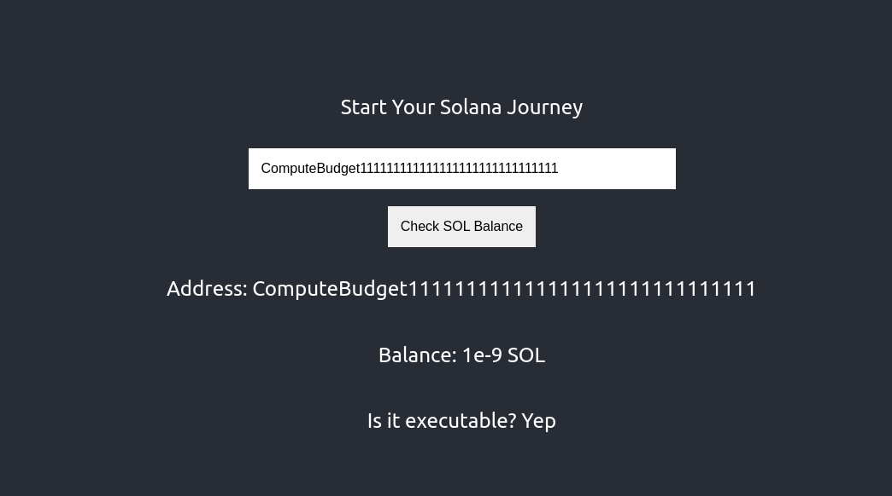
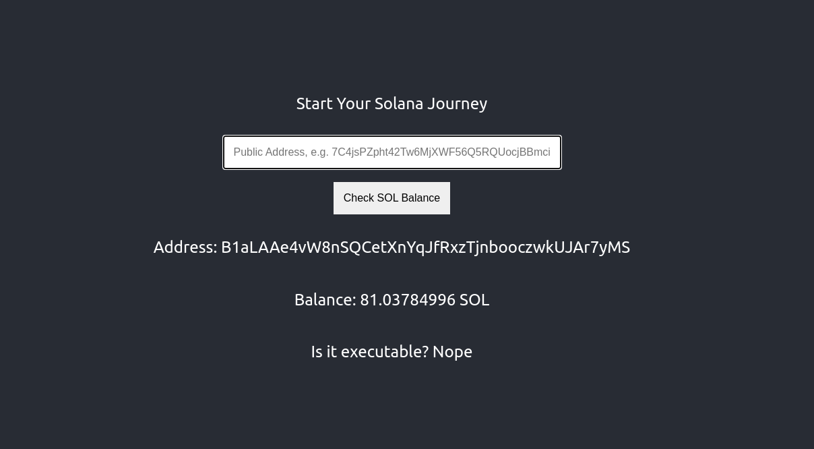

# Solana Intro Frontend

Welcome to the Solana Intro Frontend repository! This project is a simple web application built using Next.js, React, and the Solana Web3.js library. It allows you to check the balance of a Solana address and determine whether the account is executable or not.

Solana Intro Frontend was built as part of the 6-week [Solana Core Developer Program](https://buildspace.so/p/solana-core/) on [buildspace](https://buildspace.so).





## Table of Contents
- [Features](#features)
- [Getting Started](#getting-started)
  - [Prerequisites](#prerequisites)
  - [Installation](#installation)
- [Usage](#usage)
- [Understanding the Code](#understanding-the-code)
- [Resources](#resources)
- [Contributing](#contributing)
- [License](#license)
- [Support](#support)


## Features

- Enter a Solana public address to view its balance
- Determine whether the entered address is executable or not
- Learn how to use the Solana Web3.js library in a simple React application

## Getting Started

Follow these steps to set up the project locally.

### Prerequisites

Before getting started, make sure you have the following software installed on your system:

- [Node.js](https://nodejs.org/en/) 

This project was built using Node.js v18.14.0. If you use [NVM](https://github.com/nvm-sh/nvm), you can run `nvm use` to switch to the correct version.


### Installation

1. [Fork](https://docs.github.com/en/get-started/quickstart/fork-a-repo) and then clone this repository:

```bash
git clone https://github.com/<your username>/solana-intro-frontend.git
```

2. Change to the project directory:

```bash
cd solana-intro-frontend
```

3. Install the required dependencies:

```bash
npm ci 
```

4. Run the development server:

```bash
npm run dev
```

5. Open your web browser and navigate to `http://localhost:3000` to view the application.

## Usage

1. Enter a Solana public address in the input field provided on the web application.
2. Press the "Check SOL Balance" button to view the balance and executable status of the entered address.
3. The address, balance and executable status of the entered address will be displayed on the screen.

## Understanding the Code

The main functionality of the application resides in the `index.tsx` file, which imports `AddressForm` component and utilizes the Solana Web3.js library to fetch the balance and executable status of a given Solana address.

- `useState` is used to manage the local state for balance, address, and executable status.
- `addressSubmittedHandler` function is triggered when the user submits the form with a Solana address.
  - A new PublicKey object is created using the entered address.
  - A new Connection object is created to connect to the Solana devnet.
  - The `getBalance()` method is called to fetch the balance of the entered address.
  - The `getAccountInfo()` method is called to fetch the account information and determine if the account is executable or not.
- The `AddressForm` component is responsible for rendering the input field and submit button.

## Resources
- [Solana Web3.js Documentation](https://solana-labs.github.io/solana-web3.js/)
- [Solona Core Developer Program](https://buildspace.so/p/solana-core/) at [buildspace](https://buildspace.so)


## Contributing
Contributions are always welcome! If you'd like to contribute to this project or have any suggestions, feel free to create a new issue or submit a pull request. Please check the [Code of Conduct](./CODE_OF_CONDUCT.md) first.

To submit a pull request, follow these steps:
1. Fork the repository
2. Create your feature branch (`git checkout -b feature/your-feature-name`)
3. Commit your changes (`git commit -am 'Add some feature'`)
4. Push to the branch (`git push origin feature/your-feature-name`)
5. Create a new Pull Request

## License

This project is open-source and available under the [MIT License](./LICENSE.md).

## Support
If you have any questions or need help getting started, please open an issue in the repository or contact me on Twitter: @tanja_codes